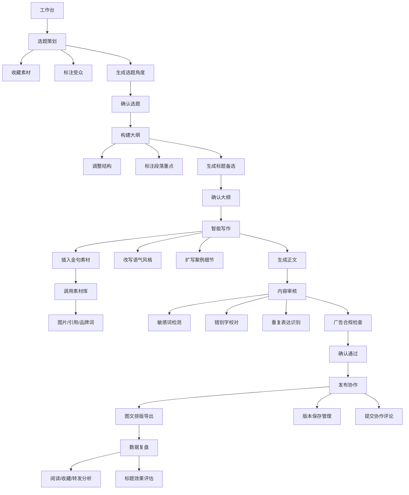

## 1. 产品概述

「墨笔」公众号文章生成平台，为内容运营提供从选题策划、素材管理、大纲构建、正文撰写、内容审核到发布复盘的一站式工作流解决方案，解决运营人员多工具切换、流程割裂、效率低下的痛点。

- 目标用户：新媒体运营、内容编辑、品牌营销人员
- 核心价值：将分散的内容生产环节整合为闭环工作流，辅以 AI 能力提升创作效率与内容质量

## 2. 核心功能

### 2.1 功能模块

1. **工作台**：待写任务看板、近期热点榜单、发布日历视图、创作进度概览
2. **选题中心**：素材收藏夹、受众画像标注、选题角度 AI 生成、竞品选题参考
3. **大纲构建**：拖拽式结构调整、段落重点标注、多版本标题备选、AI 大纲优化
4. **智能写作**：正文 AI 生成、语气风格改写、案例自动扩写、金句库插入、段落润色
5. **素材管理**：图片说明编辑、引用来源标注、品牌词库维护、素材标签分类
6. **内容审核**：敏感词检测、错别字校对、重复表达识别、广告合规检查
7. **发布协作**：图文排版导出、版本历史回溯、协作评论批注、多格式导出
8. **数据复盘**：阅读量趋势、收藏/转发分析、标题效果对比、内容表现排名

### 2.2 页面详情

| 页面名称 | 模块名称 | 功能描述 |
|---------|---------|---------|
| 工作台 | 待写任务 | 卡片式任务列表，显示选题、截止日期、状态标签，支持快速进入编辑 |
| 工作台 | 近期热点 | 实时热点榜单，按热度排序，支持一键加入选题素材库 |
| 工作台 | 发布日历 | 月视图日历，标记已发布/待发布/草稿状态，支持点击查看详情 |
| 工作台 | 数据概览 | 近 7 天关键指标：阅读数、收藏数、转发数、完成文章数 |
| 选题页 | 素材收藏 | 素材卡片瀑布流展示，支持添加链接、图片、文本笔记，标签分类 |
| 选题页 | 受众标注 | 目标受众画像标签选择、年龄/性别/地域分布、兴趣关键词 |
| 选题页 | 角度生成 | 输入核心主题，AI 生成 5-8 个切入角度，支持点赞收藏和再生成 |
| 大纲页 | 结构调整 | 左侧目录树，支持拖拽排序、折叠展开、添加/删除段落节点 |
| 大纲页 | 段落重点 | 每个段落节点可填写核心观点、字数预估、配图建议 |
| 大纲页 | 标题备选 | 多版本标题列表，AI 推荐优化建议，可投票或设置主标题 |
| 写作页 | 正文编辑器 | 富文本编辑器，支持 Markdown 语法、实时字数统计、段落折叠 |
| 写作页 | AI 工具箱 | 语气改写（正式/轻松/专业/文艺）、案例扩写、金句插入、润色重写 |
| 写作页 | 写作进度 | 大纲完成度可视化、目标字数进度条、预计完成时间 |
| 素材页 | 图片素材 | 图片网格展示、批量上传、图片说明/Alt 文本编辑、来源标注 |
| 素材页 | 引用来源 | 参考文献列表、来源链接管理、一键插入引用标注 |
| 素材页 | 品牌词库 | 品牌专有名词、禁用词、推荐话术、快捷插入模板 |
| 审核页 | 检测概览 | 问题总数统计、各类型检测进度条、风险等级标签 |
| 审核页 | 敏感词检测 | 高亮显示敏感词、提供替换建议、自定义敏感词库 |
| 审核页 | 错别字校对 | 逐句标注错误、一键修正、近义词替换建议 |
| 审核页 | 重复表达 | 语义重复段落识别、合并/改写建议 |
| 审核页 | 广告合规 | 广告法违禁词检测、医疗/金融等行业合规检查 |
| 发布页 | 排版预览 | 微信公众号样式实时预览、多种排版主题切换 |
| 发布页 | 版本管理 | 版本时间线、版本对比、一键回退、版本备注 |
| 发布页 | 协作评论 | 段落级批注、评论回复、@ 提醒、评论状态追踪 |
| 发布页 | 导出中心 | 支持 Markdown/HTML/PDF/Word 导出、一键复制公众号格式 |
| 数据页 | 阅读趋势 | 折线图展示单篇/多篇文章阅读量变化趋势、时间维度筛选 |
| 数据页 | 互动分析 | 收藏率、转发率、在看率柱状图对比、TOP 文章排行 |
| 数据页 | 标题分析 | A/B 标题效果对比、关键词表现分析、点击率排行 |

## 3. 核心流程

## 4. 用户界面设计

### 4.1 设计风格

**整体定位：编辑室质感 · 现代极简**

- **主色调**：墨黑 `#1A1A2E`（主背景/标题）、暖米 `#FAF7F2`（主背景/内容区）
- **辅助色**：朱砂红 `#C84B31`（强调/高亮/警示）、墨绿 `#2D4A3E`（成功/正向）、墨金 `#B8860B`（数据/高亮）
- **按钮风格**：胶囊形圆角（12px），主按钮墨黑填充+暖米文字，次按钮描边+透明背景
- **字体方案**：标题用「思源宋体」展现文化质感，正文用「思源黑体」保证阅读舒适度
  - 大标题：28-32px / 思源宋体 Bold / 墨黑色
  - 小标题：18-20px / 思源宋体 Medium / 墨黑色
  - 正文：14-16px / 思源黑体 Regular / `#333333`
  - 辅助文字：12px / 思源黑体 Light / `#888888`
- **布局风格**：左右分栏布局 + 顶部导航，卡片式内容承载，大量留白营造呼吸感
- **视觉细节**：纸张纹理背景、细线分割、微弱投影、朱砂红细线作为视觉锚点

### 4.2 页面设计概览

| 页面名称 | 模块名称 | UI 元素 |
|---------|---------|---------|
| 工作台 | 整体布局 | 左侧导航栏（墨黑背景+暖米图标），右侧三栏网格：任务+热点+日历 |
| 工作台 | 待写任务卡片 | 米白卡片+细线边框，状态标签（朱砂红/墨绿/灰色小圆标），悬停微上浮 |
| 工作台 | 热点榜单 | 编号用墨金大号数字，前 3 名朱砂红高亮，热度进度条 |
| 工作台 | 发布日历 | 月视图格子，不同状态用背景色区分，日期数字用思源宋体 |
| 选题页 | 素材收藏 | 瀑布流卡片布局，支持多选，卡片底部显示标签和来源 |
| 选题页 | 角度生成 | 输入框下方 AI 角度卡片，点赞/收藏/再生成图标按钮 |
| 大纲页 | 结构树 | 左侧树形目录，拖拽手柄，段落展开/折叠动画 |
| 大纲页 | 标题备选 | 横向排列标题卡片，主标题边框高亮+「主」字徽章 |
| 写作页 | 编辑器 | 仿纸张质感编辑区，行号显示，左侧大纲浮窗联动 |
| 写作页 | AI 工具箱 | 右侧悬浮工具面板，图标+文字按钮，点击弹出参数配置 |
| 素材页 | 图片网格 | 等宽瀑布流，悬停显示操作遮罩，选中状态朱砂红边框 |
| 审核页 | 检测结果 | 问题列表按严重程度排序，红色/黄色/灰色分级标识 |
| 审核页 | 原文对照 | 左右分栏：原文高亮 vs 建议修改，一键接受按钮 |
| 发布页 | 预览区 | 模拟微信公众号阅读界面，手机外框容器 |
| 发布页 | 版本时间线 | 垂直时间轴，节点用不同颜色标记版本类型 |
| 数据页 | 图表区 | 折线图/柱状图，墨金主色，数据点悬停显示详情 |
| 数据页 | 标题对比表 | 表格形式展示 A/B 标题数据，优胜项墨绿高亮 |

### 4.3 响应式设计

- **桌面端优先**：最小支持 1280px 宽度，三栏布局
- **平板端（768-1279px）**：左右两栏布局，辅助面板可折叠收起
- **移动端（<768px）**：单列流式布局，侧边导航转为底部 Tab 栏
- **触控优化**：按钮最小高度 44px，列表项增加垂直间距，支持下拉刷新

### 4.4 交互动效

- 页面切换：淡入 + 轻微上移（200ms 缓动）
- 卡片悬停：Y 轴上浮 4px + 投影加深（150ms）
- 大纲拖拽：半透明虚影跟随，落点位置高亮提示
- 编辑器输入：文字逐字淡入效果，光标柔和闪烁
- 审核检测：进度条逐条填充动画，问题标记脉冲提示
