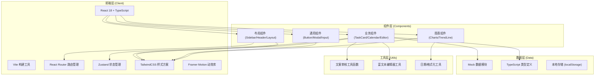
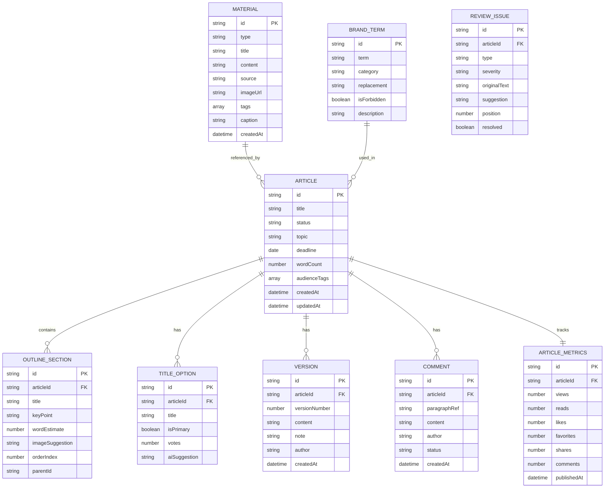

## 1. 架构设计



## 2. 技术选型说明

- **前端框架**：React 18 + TypeScript 5
  - 理由：组件化开发、类型安全、生态成熟，适合复杂交互应用
- **构建工具**：Vite 5
  - 理由：极速冷启动、HMR 热更新、配置简洁
- **样式方案**：TailwindCSS 3
  - 理由：原子化 CSS、快速原型开发、设计系统一致性
- **状态管理**：Zustand
  - 理由：轻量、无模板代码、TypeScript 友好
- **路由管理**：React Router v6
  - 理由：React 生态标准路由方案
- **动效库**：Framer Motion
  - 理由：声明式动画、手势支持、性能优秀
- **图表库**：Recharts
  - 理由：React 原生、组件化、配置灵活
- **图标库**：Lucide React
  - 理由：现代化图标风格、轻量、支持 Tree-shaking

## 3. 路由定义

| 路由路径 | 页面组件 | 用途说明 |
|---------|---------|---------|
| `/` | Dashboard | 工作台：任务、热点、日历总览 |
| `/topics` | TopicCenter | 选题中心：素材、受众、角度生成 |
| `/outlines/:id` | OutlineBuilder | 大纲构建：结构调整、段落、标题 |
| `/write/:id` | WritingDesk | 智能写作：编辑器、AI 工具箱 |
| `/materials` | MaterialLibrary | 素材管理：图片、引用、品牌词 |
| `/review/:id` | ReviewCenter | 内容审核：各项检测与修改 |
| `/publish/:id` | PublishHub | 发布协作：预览、版本、评论、导出 |
| `/analytics` | AnalyticsDashboard | 数据复盘：阅读、互动、标题分析 |

## 4. 数据模型定义

### 4.1 核心数据模型



### 4.2 TypeScript 类型定义

```typescript
// 文章状态
type ArticleStatus = 'draft' | 'topic' | 'outline' | 'writing' | 'review' | 'ready' | 'published' | 'archived';

// 文章
interface Article {
  id: string;
  title: string;
  topic: string;
  status: ArticleStatus;
  deadline: string;
  wordCount: number;
  targetWordCount: number;
  audienceTags: string[];
  content: string;
  createdAt: string;
  updatedAt: string;
  publishedAt?: string;
}

// 大纲段落
interface OutlineSection {
  id: string;
  articleId: string;
  title: string;
  keyPoint: string;
  wordEstimate: number;
  imageSuggestion: string;
  orderIndex: number;
  parentId?: string;
  children?: OutlineSection[];
}

// 标题备选
interface TitleOption {
  id: string;
  articleId: string;
  title: string;
  isPrimary: boolean;
  votes: number;
  aiSuggestion?: string;
}

// 素材
interface Material {
  id: string;
  type: 'image' | 'quote' | 'link' | 'note' | 'golden';
  title: string;
  content: string;
  source?: string;
  imageUrl?: string;
  tags: string[];
  caption?: string;
  createdAt: string;
}

// 品牌词
interface BrandTerm {
  id: string;
  term: string;
  category: 'product' | 'slogan' | 'forbidden' | 'preferred';
  replacement?: string;
  isForbidden: boolean;
  description?: string;
}

// 版本
interface Version {
  id: string;
  articleId: string;
  versionNumber: number;
  content: string;
  note: string;
  author: string;
  createdAt: string;
}

// 评论
interface Comment {
  id: string;
  articleId: string;
  paragraphRef?: string;
  content: string;
  author: string;
  status: 'open' | 'resolved';
  createdAt: string;
  replies?: Comment[];
}

// 文章数据指标
interface ArticleMetrics {
  id: string;
  articleId: string;
  title: string;
  views: number;
  reads: number;
  likes: number;
  favorites: number;
  shares: number;
  comments: number;
  readRate: number;
  shareRate: number;
  favoriteRate: number;
  publishedAt: string;
}

// 审核问题
type IssueType = 'sensitive' | 'typo' | 'duplicate' | 'compliance';
type IssueSeverity = 'high' | 'medium' | 'low';

interface ReviewIssue {
  id: string;
  articleId: string;
  type: IssueType;
  severity: IssueSeverity;
  originalText: string;
  suggestion?: string;
  position: number;
  resolved: boolean;
}

// 日历项
interface CalendarItem {
  id: string;
  date: string;
  articleId: string;
  title: string;
  status: ArticleStatus;
}

// 热点
interface HotTopic {
  id: string;
  rank: number;
  title: string;
  heat: number;
  category: string;
  trend: 'up' | 'down' | 'stable';
}

// 任务
interface Task {
  id: string;
  articleId: string;
  title: string;
  topic: string;
  status: ArticleStatus;
  deadline: string;
  progress: number;
}
```

## 5. 目录结构

```
src/
├── components/           # 通用组件
│   ├── layout/          # 布局组件
│   │   ├── Sidebar.tsx
│   │   ├── Header.tsx
│   │   └── PageLayout.tsx
│   ├── ui/              # 基础 UI 组件
│   │   ├── Button.tsx
│   │   ├── Card.tsx
│   │   ├── Modal.tsx
│   │   ├── Input.tsx
│   │   ├── Tag.tsx
│   │   ├── Badge.tsx
│   │   └── Progress.tsx
│   └── common/          # 业务通用组件
│       ├── TaskCard.tsx
│       ├── HotTopicList.tsx
│       ├── PublishCalendar.tsx
│       └── StatusBadge.tsx
├── pages/               # 页面组件
│   ├── Dashboard/
│   │   ├── index.tsx
│   │   ├── TaskPanel.tsx
│   │   ├── HotTopicsPanel.tsx
│   │   └── CalendarPanel.tsx
│   ├── TopicCenter/
│   │   ├── index.tsx
│   │   ├── MaterialCollection.tsx
│   │   ├── AudienceTagger.tsx
│   │   └── AngleGenerator.tsx
│   ├── OutlineBuilder/
│   │   ├── index.tsx
│   │   ├── OutlineTree.tsx
│   │   ├── SectionEditor.tsx
│   │   └── TitleOptions.tsx
│   ├── WritingDesk/
│   │   ├── index.tsx
│   │   ├── RichEditor.tsx
│   │   ├── AIToolbox.tsx
│   │   └── WritingProgress.tsx
│   ├── MaterialLibrary/
│   │   ├── index.tsx
│   │   ├── ImageGallery.tsx
│   │   ├── ReferenceList.tsx
│   │   └── BrandTerms.tsx
│   ├── ReviewCenter/
│   │   ├── index.tsx
│   │   ├── ReviewSummary.tsx
│   │   ├── IssueList.tsx
│   │   └── DiffViewer.tsx
│   ├── PublishHub/
│   │   ├── index.tsx
│   │   ├── PreviewPanel.tsx
│   │   ├── VersionTimeline.tsx
│   │   ├── CommentPanel.tsx
│   │   └── ExportCenter.tsx
│   └── Analytics/
│       ├── index.tsx
│       ├── ReadingTrend.tsx
│       ├── EngagementChart.tsx
│       └── TitleAnalysis.tsx
├── store/               # 状态管理
│   ├── articleStore.ts
│   ├── materialStore.ts
│   └── uiStore.ts
├── data/                # Mock 数据
│   ├── articles.ts
│   ├── materials.ts
│   ├── hotTopics.ts
│   ├── metrics.ts
│   └── brandTerms.ts
├── types/               # 类型定义
│   └── index.ts
├── utils/               # 工具函数
│   ├── review.ts        # 文案审核工具
│   ├── date.ts          # 日期格式化
│   └── text.ts          # 文本处理
├── hooks/               # 自定义 Hooks
│   ├── useArticle.ts
│   └── useLocalStorage.ts
├── App.tsx
├── main.tsx
└── index.css
```

## 6. 核心工具函数设计

### 6.1 文案审核工具 (`utils/review.ts`)

```typescript
// 敏感词检测
export function detectSensitiveWords(text: string, customList?: string[]): ReviewIssue[]

// 错别字校对
export function detectTypos(text: string): ReviewIssue[]

// 重复表达识别
export function detectDuplicateExpressions(text: string): ReviewIssue[]

// 广告合规检查
export function checkCompliance(text: string, industry?: string): ReviewIssue[]

// 执行全部检测
export function runFullReview(text: string): Promise<{
  issues: ReviewIssue[];
  summary: {
    total: number;
    high: number;
    medium: number;
    low: number;
  };
}>
```
